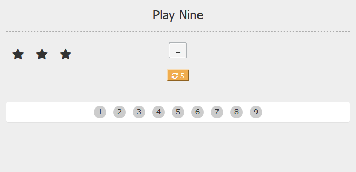

# Play Nine Game In ReactJS

This project shows how to build a simple game for kid. Let's get on to the rules to play this game.

When the game starts, you get a random number of stars between 1 and 9. And you have a set of number from 1 to 9 that you can use. You can select one or more number to sum up to random value of the stars. The objective is to correctly use all the number of in the bottom frame. If you end up with the number of stars that has no correct possible combination, you get to redraw which you can do 5 times. After that, if you still ended up with the number of stars with no correct possible combination out all remaining numbers, then you lose the game.

The game logic is built on ReactJS and its user interface is prototyped using Bootstrap 3.

[View demo site here.](http://edwinchen.co/play_nine_game_in_react/)

